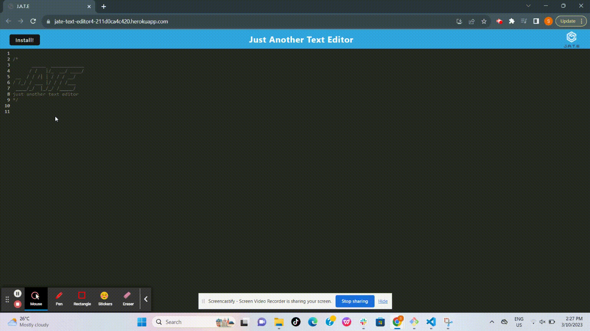
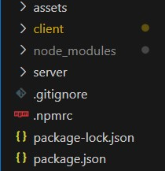
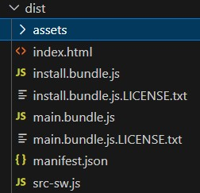
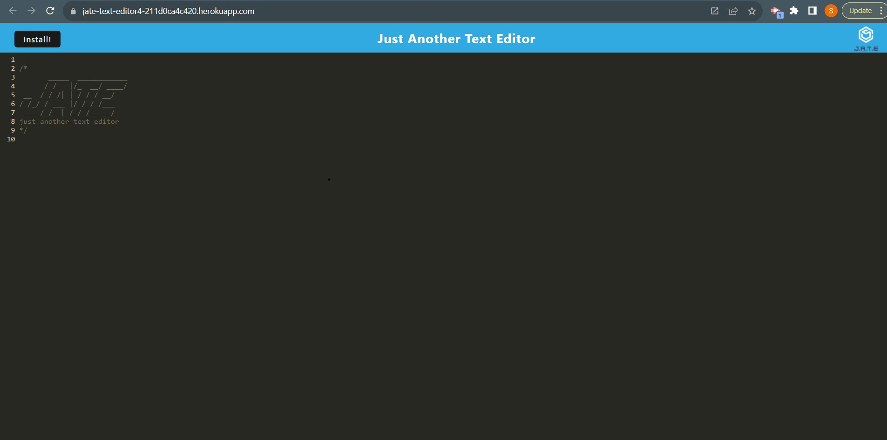
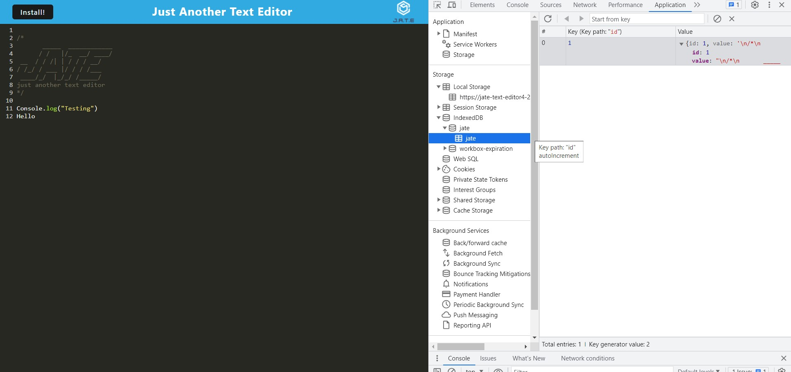
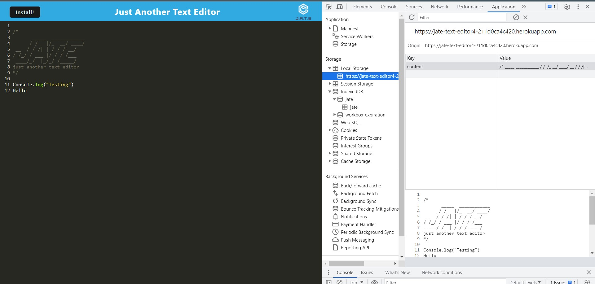
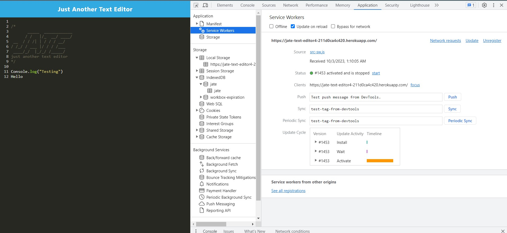
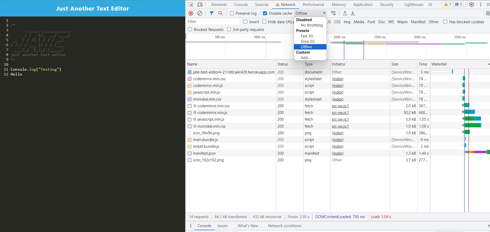
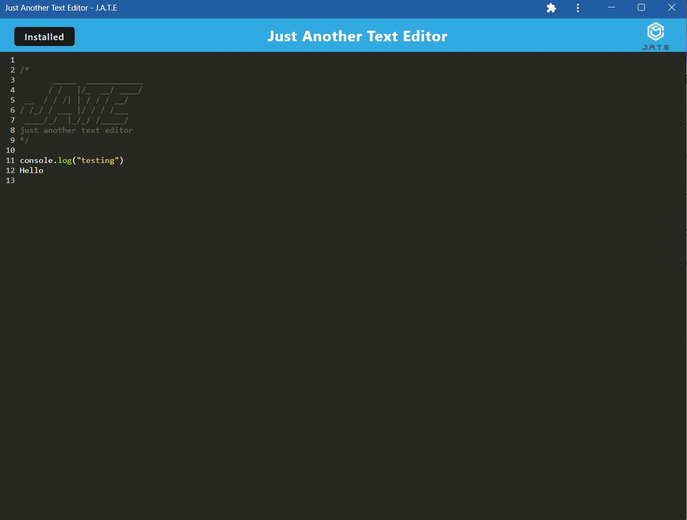
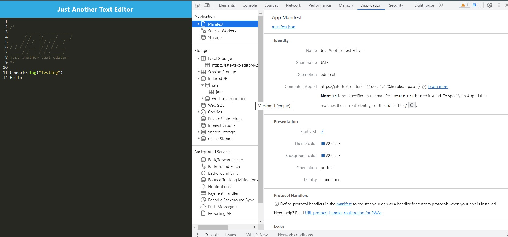

# PWA Text Editor -J.A.T.E

This is web text editor application that meets the PWA criteria The application can also be installed on computer or mobile device to be used outside of the browser. Additionally, it will feature a number of data persistence techniques that serve as redundancy in case one of the options is not supported by the browser.
The integrated service worker and Cache API's ensure that the application will remain fully functional even without active internet connection.

To build this text editor, we have implemented methods for getting and storing data to an database. J.A.T.E uses the idb package which is a lightweight wrapper around the IndexedDB API. 

## Table of Contents

- [Installation](#installation)
- [Usage](#usage)
- [Technologies](#technologies)
- [Contact Information](#contact-information)


## Installation

- Download or clone repository from GitHub to local machine.
- This application will require the installation of Node.js and various npm packages
- Node Package Manager (npm) is the standard package manager for Node.js. The package.json file contains all the details related to required packages and versions of the application.
- Open the terminal and navigate to root level of directory. Install required dependencies  by running command:
   ```
   npm run install
   ```

## Usage

Once necessary dependencies are installed, run ``` npm run start:dev ``` command in the console to start the client and server simultaneously.  

This is a live application which is deployed via Heroku: https://jate-text-editor4-211d0ca4c420.herokuapp.com/

The following animation demonstrates the application functionality:

  

This application has client server folder structure and after running start command,  JavaScript files gets bundled using webpack.

**Client Server folder**

  

It has webpack plugins to generate HTML file, service worker, and a manifest file. When user runs text editor web application on local machine via link http://localhost:3000, it displays content in browser from generated HTML file.

**Dist folder containing bundled files and other files generated by webpack**

  

  

IndexedDB immediately creates a database storage and when user enters any code or text, it will save automatically whenever you click off of the DOM window. On refresh or revisit, the text is persistent and can be retrieved from IndexedDB.

**IndexDB stored data**



**Local Storage Working**



 The app also works offline using service worker.

**Screenshot of the static assets pre cached upon loading with subsequent pages and static assets**

 

 **Running App Functionally Offline**

  

When we click on the Install button then it downloads web application as an icon on desktop using manifest setup.

**Freestanding PWA App**

 

**Manifest Setup- manifest.json**

 

## Technologies

- Express
- IndexedDB
- Webpack 
  * WebpackPwaManifest Plugins
  * Service Workers
- Concurrently
- Babel, Babel extensions
- Nodemon

## Contact Information

Github Username: [sakshiarora04](https://github.com/sakshiarora04)

Email id: sakshiarora245@gmail.com
